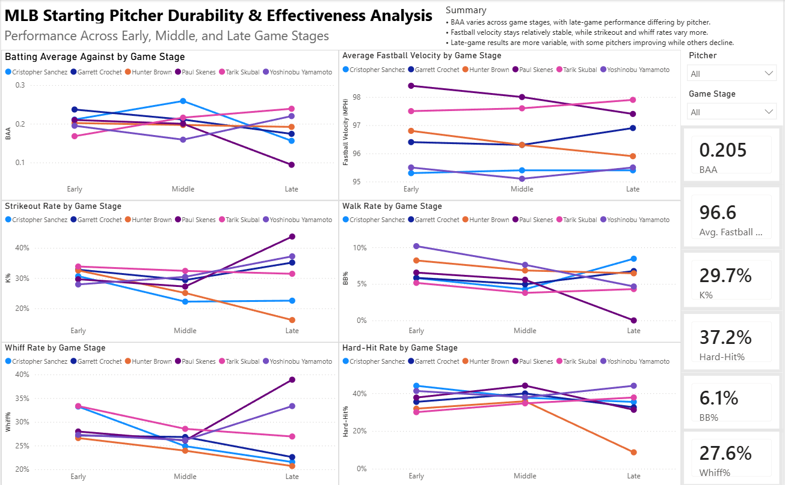

# MLB Starting Pitcher Durability & Effectiveness Analysis

## Project Overview

In this project, I wanted to answer a main question: **How does a starting pitcher's effectiveness change as they progress deeper into a game?**

I analyzed six starting pitchers: Cristopher Sanchez, Garrett Crochet, Hunter Brown, Paul Skenes, Tarik Skubal, and Yoshinobu Yamamoto. I divided their performance into Early, Middle, and Late game stages to see whether their effectiveness changed as they faced hitters deeper into games.

I compared batting average against (BAA), average fastball velocity, strikeout rate, walk rate, whiff rate, and hard-hit rate across each stage. I used SQL to clean, organize and analyze the pitching data, then built a Power BI dashboard to compare the results.

## Tools Used

- **SQL** – Data preparation, transformation, data cleaning, and analysis
- **Power BI** – Dashboard creation and data visualization

## Dashboard Overview

### Key Insights

- **BAA varied across game stages:** Late-game performance differed considerably by pitcher. Paul Skenes improved from a .210 BAA in the Early stage to .094 in the Late stage, while Tarik Skubal increased from .168 to .239.
- **Fastball velocity remained relatively stable:** Most pitchers maintained similar average fastball velocity across the three stages rather than showing a consistent decline.
- **Strikeout and whiff rates varied more by pitcher:** Paul Skenes and Yoshinobu Yamamoto finished with higher late-game strikeout and whiff rates, while several other pitchers declined.
- **Late-game results were more variable:** The pitchers did not show one consistent pattern as games progressed, with some improving in certain metrics while others declined.

## SQL Analysis

I used SQL to organize the pitching data and calculate the metrics used in the dashboard. I grouped each pitcher's performance into Early, Middle, and Late game stages so I could compare how their results changed as the game progressed.

The SQL files used for the analysis are included in this repository.
